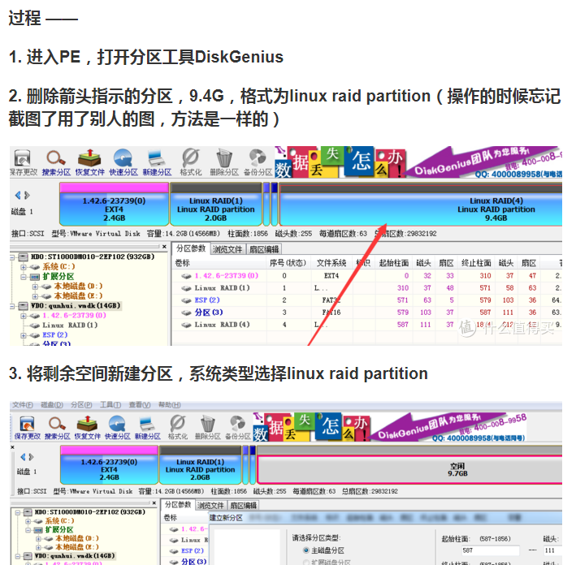

用法
=====

复制本仓库到你的github名下。

复制后，直接在仓库里修改qemuraw.sh中最前面的：
export custMIRROR='https://github.com/minlearn/qemuraw/raw/master'
export custIMGMIRROR='https://github.com/minlearn/qemuraw/raw/master'
把minlearn改成你的名字，保存

然后在要安装的机器的linux里（最好debian系）：

sudo wget https://github.com/minlearn/qemuraw/raw/master/qemuraw.sh
sudo chmod +x ./qemuraw.sh
sudo ./qemuraw.sh -i qemuraw

提示没有curl，执行sudo apt-get install binutils，返回上一句重新执行

安装后进入，用户名密码为admin,123456

这时一般无法上网，且数据区为固定50G

附：修改mac地址和扩展数据区
=====

重启，进入grub菜单中的**mac linuxpe**，开始修正mac地址，流程一般为：

sudo mount /dev/vda4
cd /mnt/vda4
vi grub.cfg

重启，进入grub菜单中的**dataextend winpe** to rebuild data partiption，流程一般为：

启动diskgen
备份32mb启动区到一个磁盘上的镜像文件
删除并重建一个新的，类型为"raid"的数据分区,这会破坏32mb启动分区，这是正常的，但会在数据分区前保留一段空区
在数据区前面的这段空区重建32mb 类型为esp,激活为可启动，并恢复启动磁盘文件

